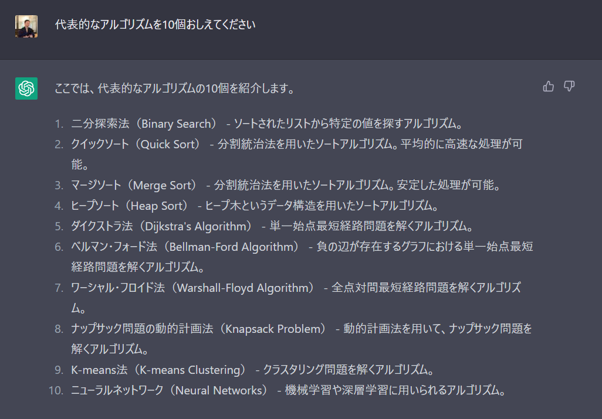
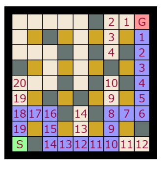
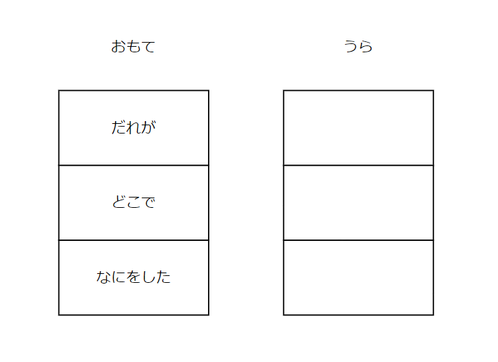
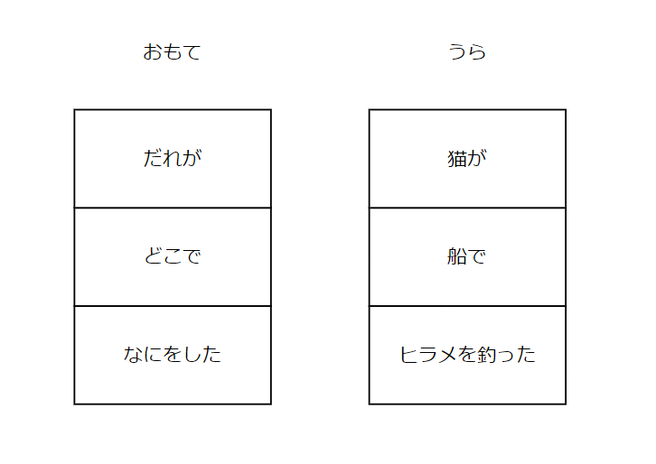

<!--
headingDivider: 1
-->

<!--
class: normal
-->

# アルゴリズムってなんだろう？
### CoderDojo神山 本橋大輔

#

### できるようになること
- アルゴリズムで考えられるようになる
- アルゴリズムで迷路を作れるようになる
- アルゴリズムで迷路の近道を見つけられる
- （おまけ）アルゴリズムで遊んでみる

#

### アルゴリズムってなんだろう？

- 大きい？　小さい？　ビッグ オア スモールで遊んでみよう

https://scratch.mit.edu/projects/754751496/

#

### 二分探索（にぶんたんさく）アルゴリズム

## 1 - 2 - 3 - 4 - 5 - 6 - 7 - 8 - 9 - 10

- 1～10の数字を探したいとき
    
    - 5？ -> 大きい？　小さい？
        - 🤔 大きいなら、6～10のどれかになるな
    - 8？ -> 大きい？　小さい？
        - 😗 小さいなら、6か7のどちらかだ！
    - 7？
        - 😁 正解！

# 総当り（そうあたり）アルゴリズム

- 1～10の数字を探したいとき
  - 🤔 1？
  - 🤔 2？
  - 🤔 3？
  - 🤔 4？
  - 🤔 5？
  - 😁 6！ 正解！

- ブルートフォース（ちからまかせ）アルゴリズムとも言います

# ブルート

# 「ちからまかせ」もコンピューターはわりと得意

- 数字をひとつずつ変えて、正解かどうか調べる、を繰り返す
- 1から100まで足す
- 1から1000まで足す
- 1から10000まで足す
- 1から100000まで足す

# ここまでに登場したアルゴリズム

- 二分探索
- 総当り（ブルートフォース）

# 

# いまからこんなアルゴリズムで遊びます

- 棒倒し迷路構築法
    - 立てた棒を倒しながら迷路の壁を作るアルゴリズム
- 幅優先探索法
    - 「広さ」を優先して調べるアルゴリズム

# アルゴリズムで迷路を作ろう

- いまからいっしょに迷路を作っていきます
- 方眼紙をご用意ください

# 方眼紙に枠を引きます

まずはタテ11マス、ヨコ11マスでやってみましょう

# ひとつおきに塗りつぶして柱を作ります

#

# 柱から見て、サイコロの目の方角に壁を作ります
- 左下の塗りつぶし（柱）の周囲に数字を書き込んで
- サイコロを振ります
  - 1～4が出たら、数字のマスを塗りつぶす
  - 5, 6が出たらもう一度

#

#

# ぜんぶの柱から壁を作ろう

#

# ぜんぶの柱から壁をつくれたら
## スタートとゴールを書き込んで出来上がり！

#

# どんな迷路ができましたか？
## ほかのひとの迷路とくらべてみよう
## もっと大きな迷路も作れるかな？

# アルゴリズムで近道を見つけよう
- サイコロは使いません
- こんな計算を使います
    - 1 + 1 = ?
    - 2 + 1 = ?
    - 3 + 1 = ?

#

#

#

# 

#

#

### コンピューターは繰り返しが得意

- １秒間に 100京回 の計算ができる世界一のスーパーコンピューター
- １秒間に 7000億回 の計算ができる僕のパソコン
- １秒間に....人間は
  - ソロバンだと、5回 くらい行けるかな？

- 一, 十, 百, 千, 万, 億, 兆, 京, 垓 ... 

### 小さな計算をたくさん繰り返すことがとっても得意

# 迷路を作るのも解くのも小さな計算でした

- 迷路をつくる
    - サイコロを振って壁を作る
    - 次の柱に移動する
    - ※くりかえし

- 迷路をとく
    - 足元の数字に1を足したものを四方向のマスに書き込む
    - 次のマスに進む
    - ※くりかえし

# コンピューターに迷路を解いてもらいます

- https://github.com/motohasystem/p5_easy_maze

# おまけ1

https://www.tinkercad.com/codeblocks/edit?doc=7K1rVtzmFda

#

#

#

# おまけ2

#

#

#

