<!--
headingDivider: 1
-->

<!--
class: blue
-->

# アルゴリズムってなんだろう？

<!--  -->
<!-- 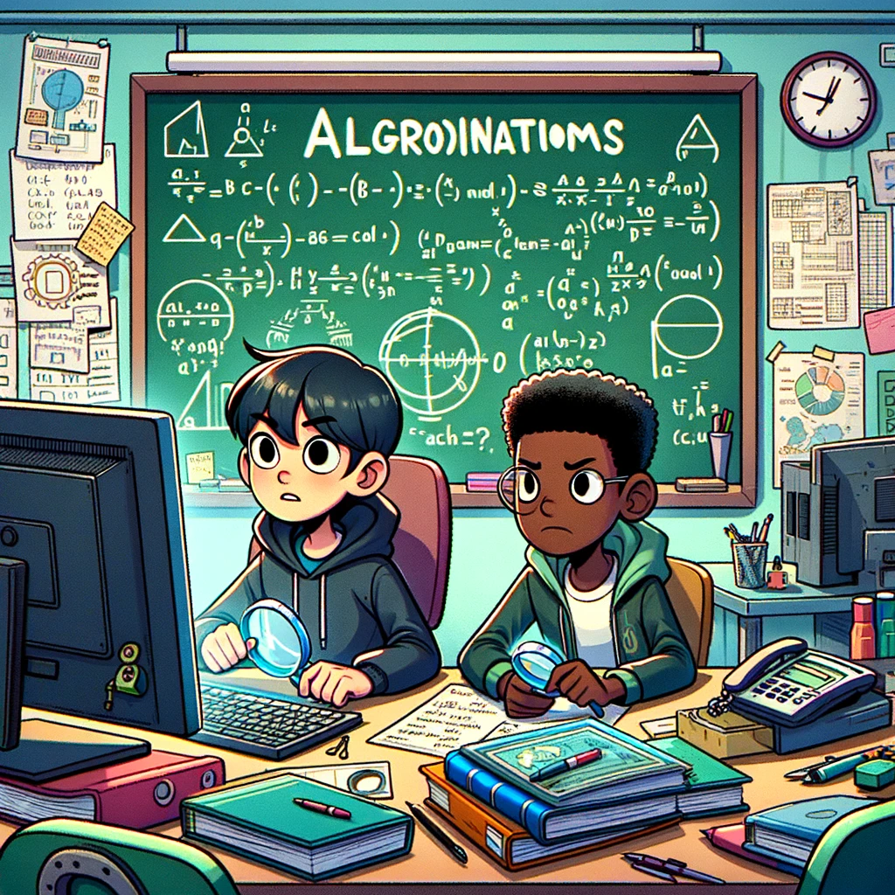 -->

#### CoderDojo神山 本橋大輔

# 今日できるようになること
#### アルゴリズムを見つけられるようになる
#### アルゴリズムで考えられるようになる
#### アルゴリズムで迷路を作れるようになる
#### アルゴリズムで迷路の近道を見つけられる
#### （おまけ）アルゴリズムで遊んでみる

# アルゴリズムってなんだろう？
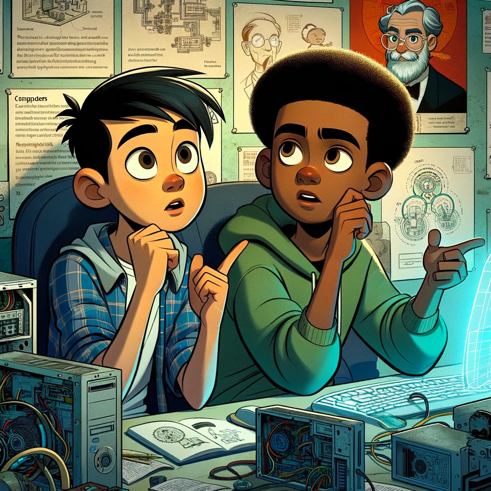

# 身の回りにあるアルゴリズム
- 時間割？
- しりとり？
- 目覚まし時計？
- ゆうやけこやけ？
- エアコンの温度設定？
- アレクサ ? / Ok google ？

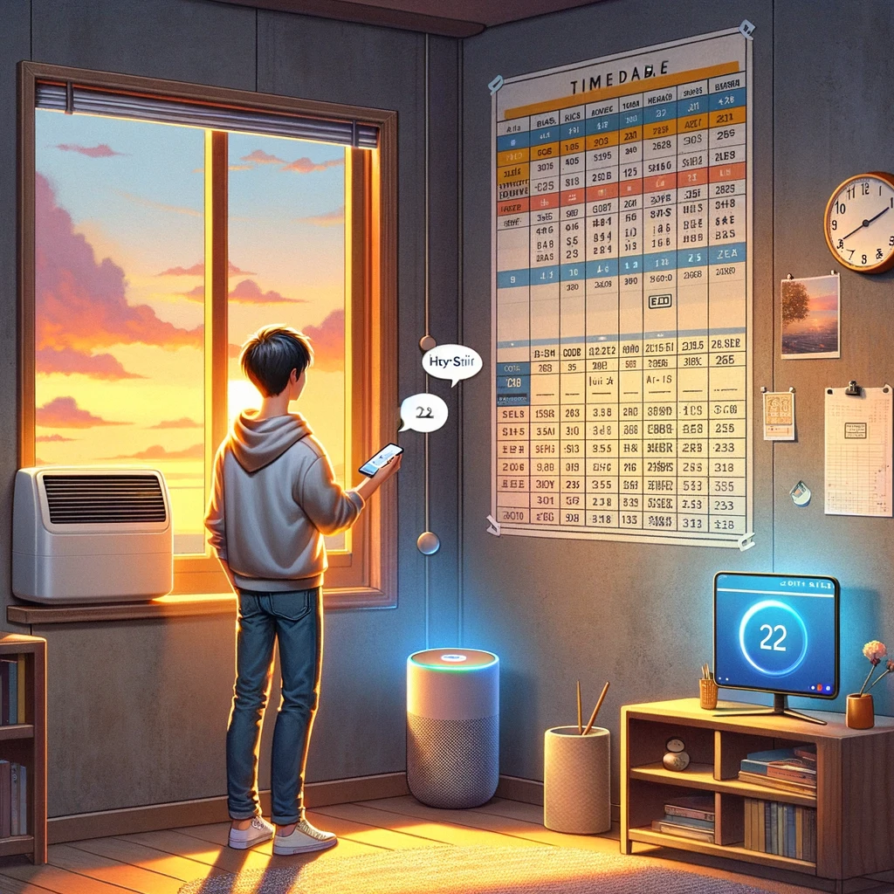

# ミニゲーム
## Big or Small

> https://scratch.mit.edu/projects/754751496/

# 二分探索アルゴリズム

##### 1 - 2 - 3 - 4 - 5 - 6 - 7 - 8 - 9 - 10

🤔  『5かな？』
🐈  『もっと大きいよ』
🤔  『6～10のどれかになるな』
🤔  『8かな？』
🐈  『もっと小さいよ』
😗  『小さいなら、6か7のどちらかだ！』
🤔  『7だ！』
🐈  『正解！』

# ブルートフォース（ちからまかせ）アルゴリズム

- 1～10の数字を探したいとき
  - 🤔 1？
  - 🤔 2？
  - 🤔 3？
  - 🤔 4？
  - 🤔 5？
  - 😁 6！ 正解！

# ブルート

# 「ちからまかせ」はコンピューターの得意技

##### 数字をひとつずつ変えて、正解かどうか調べる、を繰り返す

        1 ⇨ 2 ⇨ 3 ⇨ 4 ⇨ ....
<!-- [...Array(11).keys()].reduce((i,p)=>{return i+p}) -->

# アルゴリズムの力試し

## 1から10まで足したらいくつ？

        1 + 2 + 3 + ... + 10 = ?

# アルゴリズムの力試し(2)

## 1から100まで足したらいくつ？
        1 + 2 + 3 + ... + 100 = ?

# アルゴリズムの力試し(3)

## 1から1000まで足したらいくつ？
        1 + 2 + 3 + ... + 1000 = ?

# こんな計算やってられない

- 1から100まで足す
    - 100回の足し算
- 1から1000まで足す
    - 1000回の足し算
- 1から10000まで足す
    - 10000回の足し算
- 1から100000まで足す
    - 100000回の足し算

# 「アルゴリズム」で計算すると早い
- 1から100まで足す
    - 1 + 100 x 50 = 5050

## 1回の足し算と、1回の掛け算で計算できる

# 「アルゴリズム」で計算すると早い
- 1から100まで足す
    - 1 + 100 x 50 = 5050

- 1から100000まで足す
    - 1 + 100000 x 5000 = 50005000

# アルゴリズム
## ガウスの計算法
- 1から100まで足す
    - (1 + 100) x 50 = 5050
- 1から10000まで足す
    - (1 + 1000) x 500 = 500500
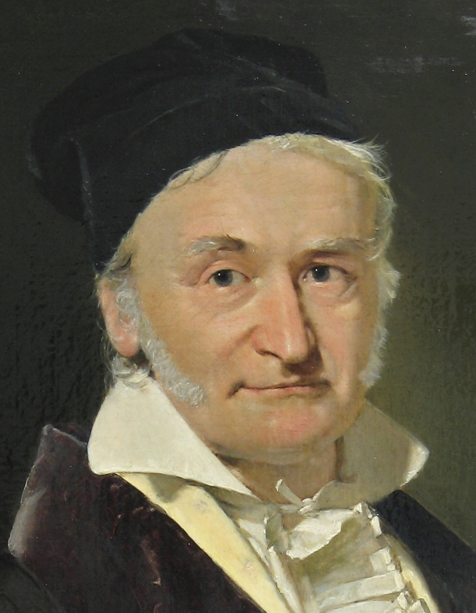

##### 1回の足し算と、1回の掛け算だけ

# アルゴリズムの面白いところ

$$\frac{(1+N) \times N}{2}$$

## １つの式で書いてしまえる

# ここまでに登場したアルゴリズム

- 二分探索
- 総当り（ブルートフォース）
- ガウスの計算法

# おまけのアルゴリズム

## ソロバンだと

#
## **1946年**
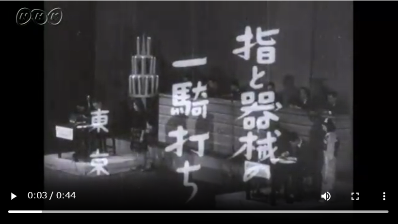

# 計算機と互角だったそろばん

- 終戦直後、そろばん名人と機械式計算機の対決(1946)
    ⇨ 「名人」の勝利

練習なしに**計算できる**時代に突入

>>> 3月20日　電卓の日｜きょうの蔵出しNHK｜時代｜NHKアーカイブス
>>> https://www.nhk.or.jp/archives/jidai/special/today/0320/

# ソロバンを超える高速な計算能力

- １秒間に 10回 くらい
    - そろばん
- １秒間に 7000億回 の計算
    - パソコンやスマホ
- １秒間に 120京回 の計算
    - 世界一のスーパーコンピューター(Frontier)

>>> そろばん「フラッシュ暗算」で世界記録　3桁の数字15個の和を1.60秒で計算 – 早稲田ウィークリー
>>> https://www.waseda.jp/inst/weekly/attention/2016/06/21/8369/

# いまからこんなアルゴリズムで遊びます

- 棒倒し迷路構築法
    - 立てた棒を倒しながら迷路の壁を作るアルゴリズム
- 幅優先探索法
    - 「広さ」を優先して調べるアルゴリズム

# アルゴリズムで迷路を作ろう

- 迷路を作っていきます
- 方眼紙をご用意ください

# 方眼紙に枠を引きます

まずはタテ11マス、ヨコ11マスでやってみましょう

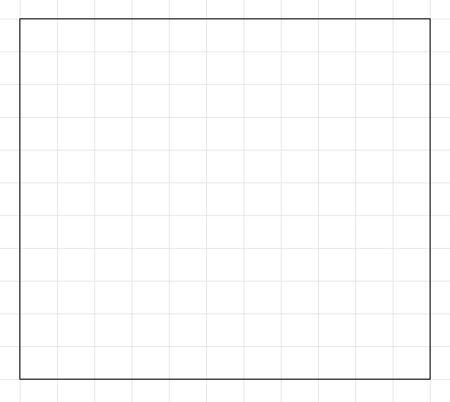

# ひとつおきに塗りつぶして柱を作ります

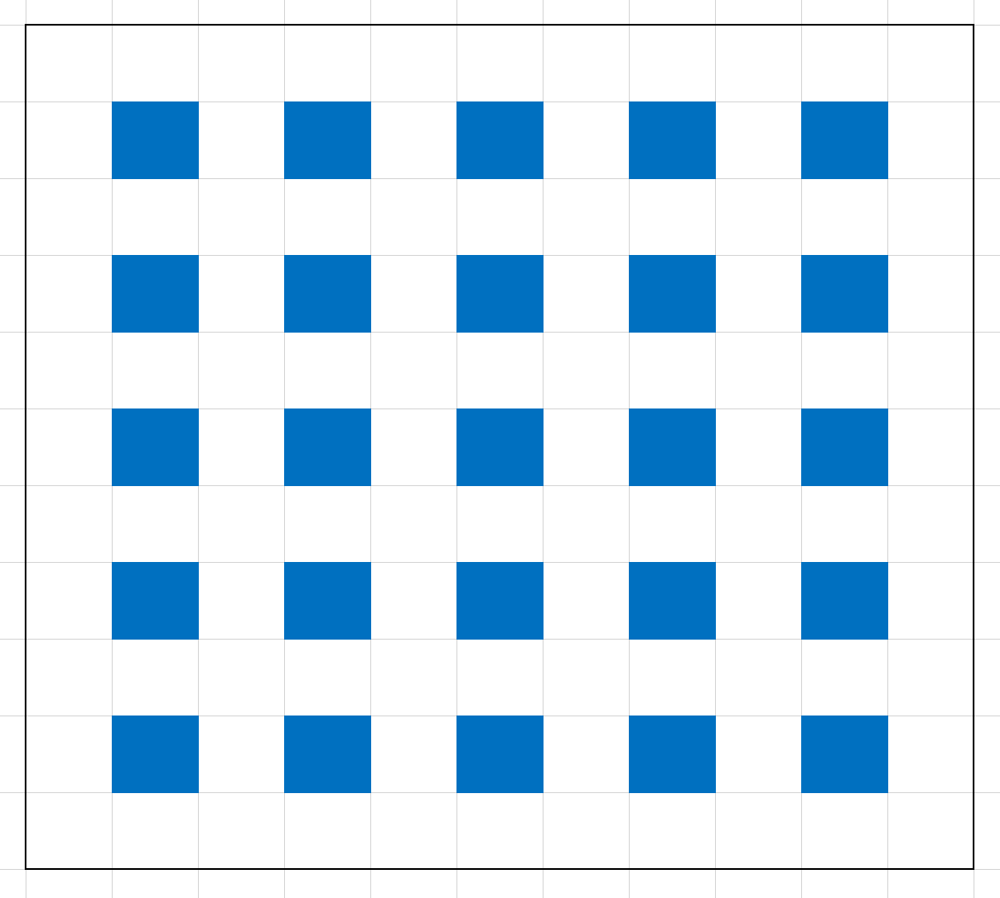

# 柱から見て、サイコロの目の方角に壁を作ります
- 左下の塗りつぶし（柱）の周囲に数字を書き込んで
- サイコロを振ります
  - 1～4が出たら、数字のマスを塗りつぶす
  - 5, 6が出たらもう一度

#

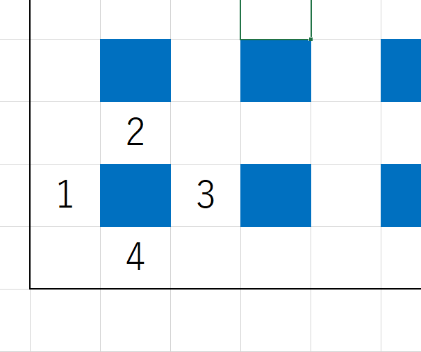
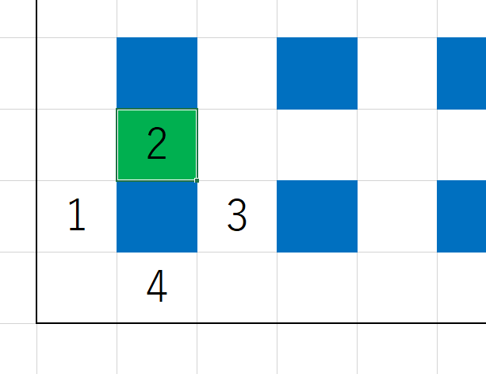

#
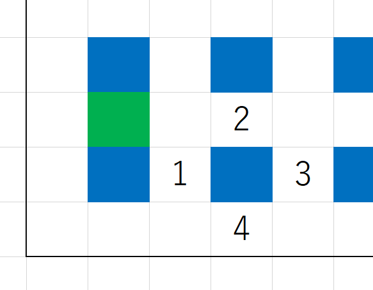
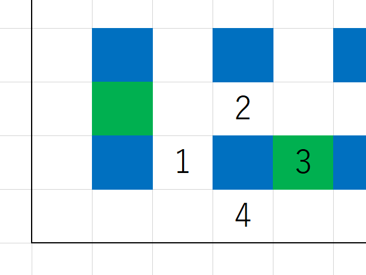

# ぜんぶの柱から壁を作ろう

# 2行目は左、上、右のどれかに壁を置きます

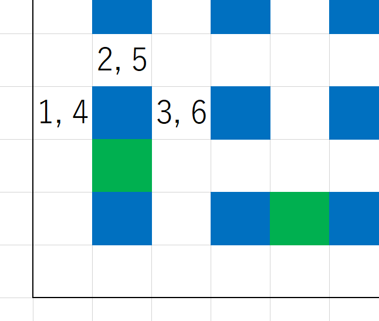

# ぜんぶの柱から壁をつくれたら
## スタートとゴールを書き込んで
## 自分だけの迷路の出来上がり！

#

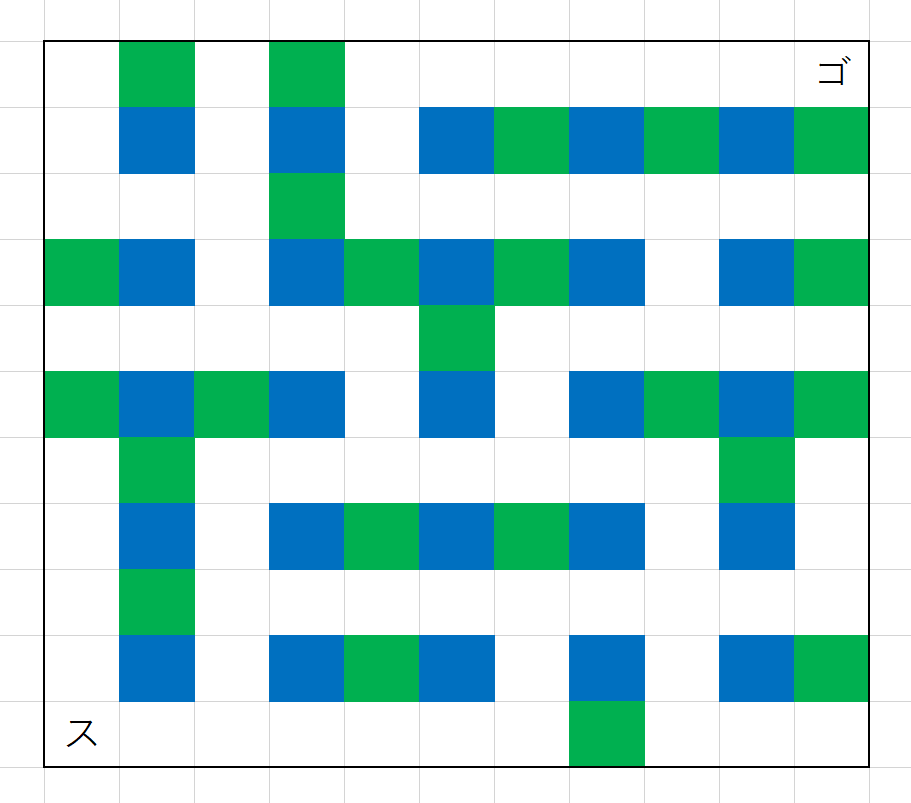

# どんな迷路ができましたか？
## ほかのひとの迷路とくらべてみよう
## もっと大きな迷路も作れるかな？

# アルゴリズムで近道を見つけよう
- サイコロは使いません
- こんな計算を使います
    - 1 + 1 = ?
    - 2 + 1 = ?
    - 3 + 1 = ?

#

#

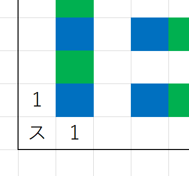
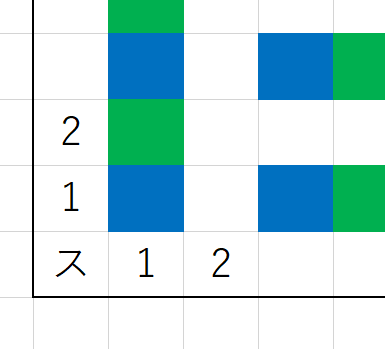

#

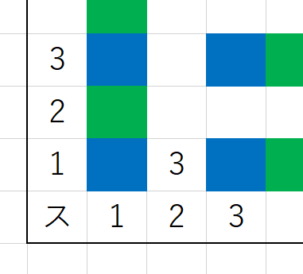
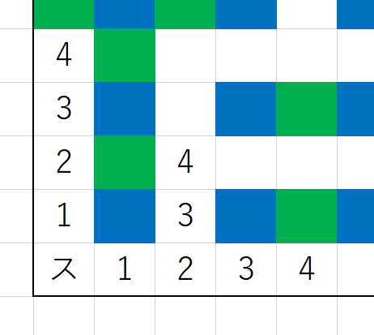

# 

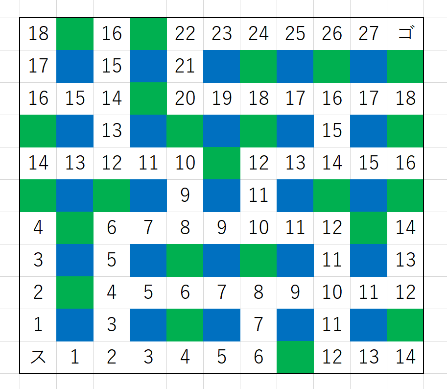

#

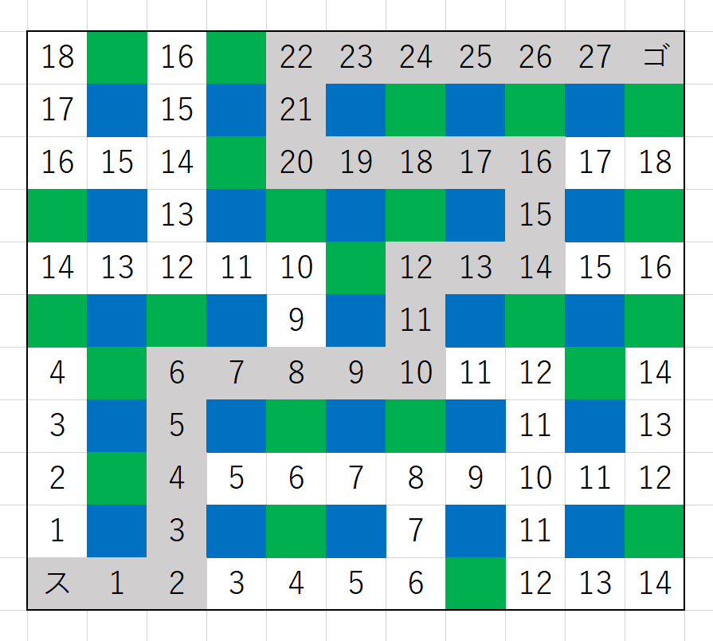

#

### コンピューターは繰り返しが得意

- １秒間に 100京回 の計算ができる世界一のスーパーコンピューター
- １秒間に 7000億回 の計算ができる僕のパソコン
- １秒間に....人間は
  - ソロバンだと、5回 くらい行けるかな？

- 一, 十, 百, 千, 万, 億, 兆, 京, 垓 ... 

### 小さな計算をたくさん繰り返すことがとっても得意

# 迷路を作るのも解くのも小さな計算でした

- 迷路をつくる
    - サイコロを振って壁を作る
    - 次の柱に移動する
    - ※くりかえし

- 迷路をとく
    - 足元の数字に1を足したものを四方向のマスに書き込む
    - 次のマスに進む
    - ※くりかえし

# では、コンピューターに迷路を解かせよう

> https://motohasystem.github.io/p5_easy_maze/

# おまけ1

https://www.tinkercad.com/codeblocks/edit?doc=7K1rVtzmFda

#

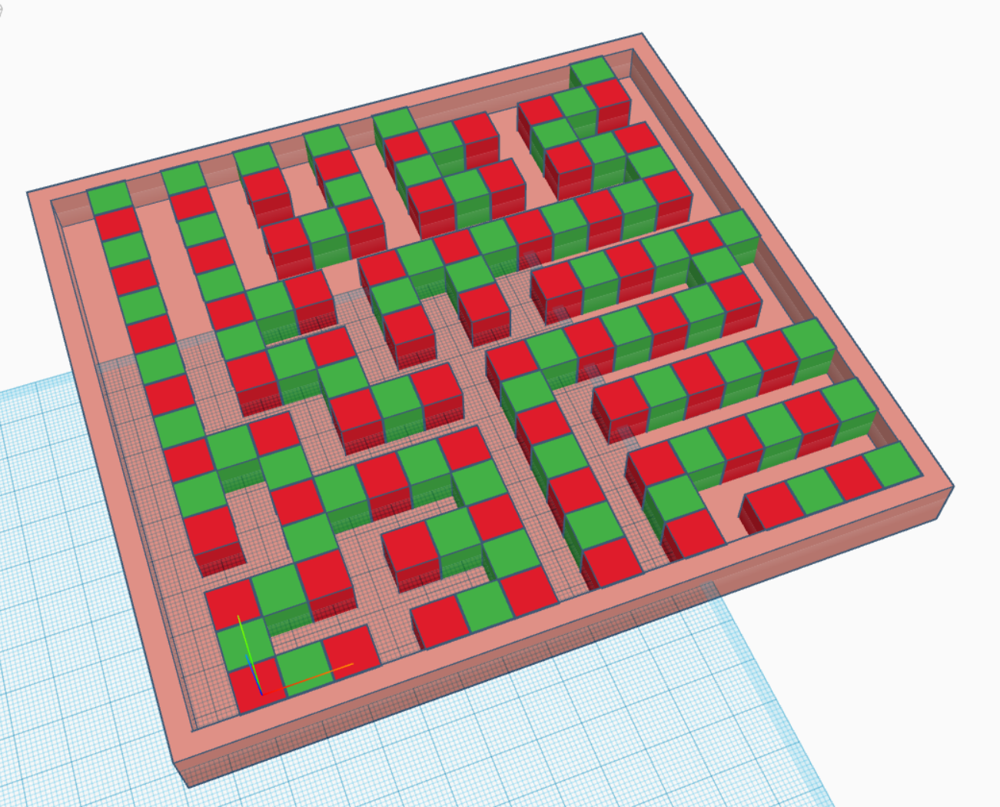

#

#

# おまけ2

<!-- #

#

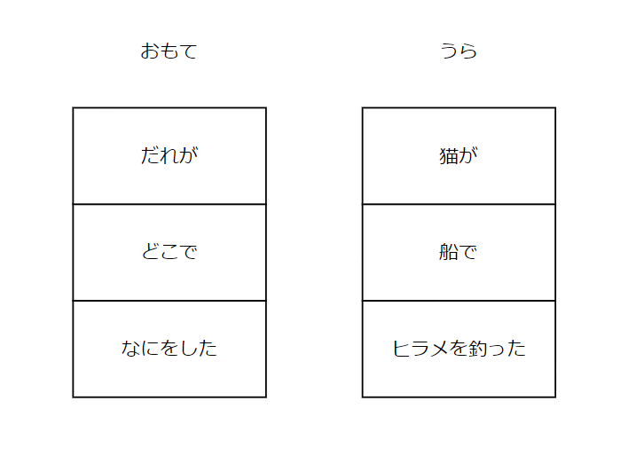

#

 -->
